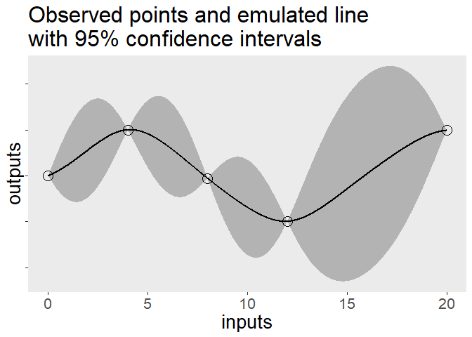

Gaussian process emulation
================
Ciarán McInerney
2023-06-26

#### Requisites

``` r
# Load packages.
library(tidyverse)
library(RobustGaSP)
library(FME)
library(plotly)
# Set seed.
set.seed(1)
```

## TL;DR

**Emulators are models of models, where models are just simplified
representations of something. People often make emulators of simulators
when their simulators are too costly to run as often as they’d like. A
good emulator is one that can produce outputs sufficiently similarly to
what the underlying simulation would produce, for the same inputs. You
can use any modelling approach as an emulator, keeping in mind that you
want your emulator to be simpler, faster, and/or cheaper than the model
it is emulating. Gaussian processes are a common choice but even [random
forests have been used as simplified representations of ocean trophic
models](https://www.stat.colostate.edu/~hooten/papers/pdf/Hooten_etal_JABES_2011.pdf).**
<br/><br/> **Benefit of Gaussian process emulators are that**

1.  **in addition to providing outputs from a simpler model, they
    provide likely functions that satisfy the input-output relationship,
    and**

2.  **it inherently quantifies the uncertainty of emulations.**

<br/><br/> <br/><br/>

## Why?

So, what is the motivation behind Gaussian processes emulators?
<br/><br/> First of all, if you want to know about Gaussian processes,
you can [check out my other
explainer](https://github.com/ciaranmci/SoMaS). For now, it suffices to
know that they are the statistical foundation upon which Gaussian
process emulators are based - go figure! <br/><br/> Emulators are just
models, but the term is usually used to indicate that the model in
question is a model of a model, rather than a model of reality. You
might want to make an emulator when the underlying model is too
expensive to run. As I hoped you have guessed, the emulator really
should be less expensive to run than the underlying model, otherwise you
are wasting your time. <br/><br/> The origin of emulation is often said
to arise from the work of Jerome Sacks and friends in their “[Design and
Analysis of Computer
Experiments](https://sci-hub.wf/https://www.jstor.org/stable/2245858)”.
The Bayesian approach was then developed and promoted by Carla Currin
and her pals. An academic summary can be found in [Currin et
al. (1991)](https://sci-hub.wf/https://www.jstor.org/stable/2290511)
which builds a bit on their previous work in [Currin et
al. (1989)](https://technicalreports.ornl.gov/cpr/rpt/6863.pdf).
<br/><br/> <br/><br/>

## Seriously, what?

I like [Andrianakis et
al.](https://journals.plos.org/ploscompbiol/article/file?id=10.1371/journal.pcbi.1003968&type=printable)’s
description of emulators as Bayesian representations of a simulator. It
communicates two key notions:

1.  that the emulator isn’t trying to model the simulator with
    fidelity - and definitely not model reality with fidelity, and

2.  that the emulator is based in abstract probabilistic relations
    between the inputs and outputs.

A Gaussian process emulator is trying to find the functions that fit a
given set of input-output tuples. Even though Euclid tells us that there
is only one straight line that passes through two points, there are an
infinite number of functions that can. A Gaussian process emulator
leverages traits of Gaussian processes to fit all of these functions. As
I note in [my Gaussian processes
explainer](https://github.com/ciaranmci/SoMaS), the trick is to think of
each value of your inputs to have its own Gaussian distribution. If I
make a few assumptions about how these value-specific distributions
linearly combine, then I can infer the distributions of the input values
that I haven’t observed yet. <br/><br/> Looking at the plot below, you
will see that I’ve fitted a Gaussian process emulator to some
input-output tuples. The hollow circles indicate input-output tuples
that I observed and used to train the emulator, and the black line is
the smooth, mean function that the emulator suggested. The grey bulges
indicate the emulator’s uncertainty around it’s mean emulation.

``` r
# Generate some fake data.
inputs <- seq(from = 0, to = 20, by = 4)
inputs <- inputs[c(1:4,6)]
outputs <- sin(inputs * 0.4)
df_sim <- data.frame(inputs, outputs)
# Fit a Gaussian process emulator.
mod_GPE <-
  RobustGaSP::rgasp(design = inputs,
                    response = outputs)
predict_input <-
  data.frame( inputs = seq(from = min(inputs), to = max(inputs), by = 0.01))
df_GP <-
  data.frame(
      predict_input = predict_input,
      model_prediction = predict(mod_GPE, predict_input)
    )
# Plot.
(p_GPE <-
  ggplot() +
    geom_ribbon(data = df_GP, aes(x = inputs, ymin = model_prediction.lower95, ymax = model_prediction.upper95), fill = "grey70") +
    geom_point(data = df_sim, aes(x = inputs, y = outputs), size = 5, shape = 1) +
    geom_line(data = df_GP, aes(x = inputs, y = model_prediction.mean), linewidth = 1) +
    labs(title = "Observed points and emulated line\nwith 95% confidence intervals") +
    theme(panel.grid.major = element_blank(),
          panel.grid.minor = element_blank(),
          axis.text.y = element_blank(),
          text = element_text(size = 20))
)
```


There are two things I want you take away from this plot:

1.  Note that the clouds of uncertainty disappear at the points where we
    have observed the input-output relationship, but expand in the
    regions between.

2.  Note that the cloud of uncertainty around the region of
    $12\le x \le 20$ is larger than elsewhere.

By considering these to notes, it should be clear that our emulator will
only be as good and as certain as the quality, quantity, and range of
the observations used to fit it. This is true for any model, though I’ve
heard some people talk about Gaussian process emulators as if they
magically make bad data good - perhaps because it makes for pleasant
smooth curves…sometimes. <br/><br/> So what is a Gaussian process
emulator? It is a model of a model, where the higher-level model uses
traits of Gaussian processes to provide the distributions of all
functions that satisfy our observations. Emulators are not restricted to
Gaussian processes, though. For example, [Hooten et
al.](https://www.stat.colostate.edu/~hooten/papers/pdf/Hooten_etal_JABES_2011.pdf)
use random forests as their emulator.

### …and what are covariance functions?

I discuss covariance functions in [my Gaussian processes
explainer](https://github.com/ciaranmci/SoMaS). I won’t go into too much
detail here because I find that many resources online confuse Gaussian
processes with Gaussian process emulators, and sometimes make things
worse by called them Gaussian process regressions. Covariance functions
are an fundamental attribute of Gaussian processes, but are just a
design choice for emulators - just another dial to twist and tune. My
most-succinct explanation is that covariance functions are a
hyperparameter that dictates the smoothness of your emulation by
specifying how the outputs should relate to each other. You can think of
it as specifying the correlation between adjacent and distant values on
the fitted curve. <br/><br/> One additional piece of information that
you might find useful is that the word “covariance” is sometimes swapped
for “correlation”, and they are also often called kernels, just like
those used in support vector machines. <br/><br/>

## How?

To illustrate a Gaussian process emulator, I’ll use the two-input toy
example from [Bastos and
O’Hagan](https://sci-hub.wf/10.1198/tech.2009.08019). <br/><br/> Each of
$n$ iterations, $i=(1, 2, \ldots , n)$, of the simulation takes two
real-numbered inputs, $a$ and $b$, with range between 0 and 1 inclusive,
to produce an output, $y$, according to the function

$$
y = (1-e^{-\frac{1}{2b}}) \left(\frac{2300a^3+1900a^2+2092a+60}{100a^3+500a^2+4a+20}\right)
$$

I’ll fit a Gaussian process emulator on the inputs and outputs of 20
simulations; these 20 tuples will provide the ‘train’ dataset. I’ll
assess my Gaussian process emulator on a separate set of inputs and
outputs from another 25 simulations; these 25 tuples will provide the
‘test’ dataset. The values for inputs will be selected by latin
hypercube sampling. <br/><br/> <br/><br/> Let’s crunch those numbers and
view the first few tuples of $(a, b, y)$.

``` r
# Set simulation parameters.
n_train <- 20
n_test <- 25
# Set input values.
possVals <- data.frame(min = c(0, 0), max = c(1, 1))
rownames(possVals) <- c("a", "b")
df_GPE_train <- FME::Latinhyper(possVals, n_train) %>% data.frame()
df_GPE_test <- FME::Latinhyper(possVals, n_test) %>% data.frame()
# Calculate and append output values.
df_GPE_train <-
  df_GPE_train %>%
  dplyr::mutate(
    y = 
      (
      1 - exp(-(1 / (2*b)) )
    ) *
      (
        sum( (2300*a^3), (1900*a^2), (2092*a), 60 ) /
          sum( (100*a^3), (500*a^2), (4*a), 20 )
      )
  )
df_GPE_test <-
  df_GPE_test %>%
  dplyr::mutate(
    y = 
      (
      1 - exp(-(1 / (2*b)) )
    ) *
      (
        sum( (2300*a^3), (1900*a^2), (2092*a), 60 ) /
          sum( (100*a^3), (500*a^2), (4*a), 20 )
      )
  )
# Display first few tuples of training dataset.
knitr::kable(head(df_GPE_train))
```

|         a |         b |        y |
|----------:|----------:|---------:|
| 0.4967353 | 0.3456438 | 8.865028 |
| 0.5606071 | 0.7146802 | 5.834341 |
| 0.2325837 | 0.7729533 | 5.522402 |
| 0.5062778 | 0.6666197 | 6.117646 |
| 0.0133610 | 0.8325435 | 5.234677 |
| 0.0693057 | 0.9629008 | 4.696036 |

All looks good so let’s continue. <br/><br/> I will use a Gaussian
covariance / correlation function (a.k.a. a kernel) to define how any
two given values of an input - i.e. either $a$ and $a^{\prime}$ or $b$
and $b^{\prime}$ - co-vary. If we only had a one-dimensional input, $a$,
then the Gaussian covariance function would simply be

$$
C(a, a^{\prime},\psi_{a})=exp \left( - \left( \frac{a-a^{\prime}} {\psi_{a}} \right)^2  \right)
$$

where $\psi_{a}$ is the correlation length parameter (a.k.a. the
characteristic length-scale of the process) for input $a$, which is
estimated when fitting the emulator. As the denominator of the fraction,
it scales / tempers the difference between two given values of $a$,
effectively dictating the reach of the correlation influence between
values of $a$. <br/><br/> A larger length parameter leads to a smaller
quotient being squared, which leads to a smaller correlation, for a
given difference. As you might already have inferred, the choice of the
covariance function and its parameters affect how smooth our emulator
outputs are. For example, functions are smoother if the correlation is
stronger over larger differences in the values. <br/><br/> Of course, we
have a two-dimensional input denoted by the tuple $(a_{k}, b_{k})$ so
the covariance function needs to accommodate both dimensions. Following
the particular multi-dimensional Gaussian covariance function used by
[Bastos and O’Hagan](https://sci-hub.wf/10.1198/tech.2009.08019), we get

$$
C((a, b), (a^{\prime}, b^{\prime}), (\psi_{a}, \psi_{b})) =exp \left( - \left( \frac{a-a^{\prime}} {\psi_{a}} \right)^2  + \left( \frac{b-b^{\prime}} {\psi_{b}} \right)^2\right)
$$

So, let’s fit the emulator to the predictions and see what we get.

``` r
# Fit model using 'train' data.
model <-
  DiceKriging::km(design = data.frame(df_GPE_train %>% dplyr::select(a, b)),
                  response = data.frame(y = df_GPE_train$y),
                  covtype = "gauss")
# Predict values using 'test' data.
model_predict <-
  predict(model,
          newdata = df_GPE_test %>% dplyr::select(a, b),
          type = "SK")
# Prepare plotting data.
df_GPE_predict <-
  df_GPE_test %>%
  dplyr::mutate(
    predicted_mean = model_predict$mean,
    predicted_upper95 = model_predict$upper95,
    predicted_lower95 = model_predict$lower95,
  )
df_GPE_predict <-
  dplyr::bind_rows(
    df_GPE_predict %>%
      dplyr::select(x = a, y, predicted_mean, predicted_upper95, predicted_lower95) %>%
      dplyr::mutate(group = "input a"),
    df_GPE_predict %>%
      dplyr::select(x = b, y, predicted_mean, predicted_upper95, predicted_lower95) %>%
      dplyr::mutate(group = "input b"),
    )
# Plot all ys for every x in the simulations, overlay the mean GPE prediction, 
# and overlay the 95% confidence intervals for the prediction.
(p_GPE_predict <-
  df_GPE_predict %>%
  ggplot() +
    geom_ribbon(aes(x = x, ymin = predicted_lower95, ymax = predicted_upper95), fill = "grey70") +
    geom_point(aes(x = x, y = y), size = 5, shape = 1) + # Test points.
    geom_line(aes(x = x, y = predicted_mean), linewidth = 1) + # Predicted mean.
    labs(x = "Input value", y = "Output value",
         title = "Predicted points and emulated line with 95% confidence intervals",
         subtitle = "Note how the confidence interval is so narrow that is barely visible behind the predicted mean except\nfor a few regions.") +
    facet_wrap(~group) +
    theme(panel.grid.major = element_blank(),
          panel.grid.minor = element_blank(),
          text = element_text(size = 10))
)
```


Rather astonishingly, the Gaussian process emulator has done a terrific
job of fitting to the observed input-output tuples. The band of
uncertainty around the mean emulation is barely visible. This showcases
how versatile Gaussian process emulators are; our complicated and
arbitrary function was easily handled. <br/><br/> The model fitted and
we got some predictions. So, what now? <br/><br/>

### But is it any good?

Just because you can, doesn’t mean you should. If we use Gaussian
process emulators, then we should evaluate how well they are emulating
the simluation of the real world, rather than just assuming that they
are representing the real-world well. Never forget that emulators are
models of models - that’s twice removed from the reality about which we
want to make inference. <br/><br/> A worthwhile read on this topic is
[Leonardo
Bastos](https://scholar.google.com/citations?user=A5VmZYMAAAAJ&hl=en&oi=sra)
and [Anthony
O’Hagan](https://scholar.google.com/citations?user=CljxR1UAAAAJ&hl=en&oi=sra)‘s
2009 paper on “[Diagnostics for Gaussian process
emulators](https://sci-hub.wf/10.1198/tech.2009.08019)”, which they
wrote during their time at University of Sheffield. The fundamental idea
is that models’ validity is usually assessed by comparing observations
to predictions, but these are one and the same for emulators. The trick
is to notice that the observations from the simulator and the
predictions from the emulator are only the same for the observations
used to ‘train’ / fit the emulator. A ‘test’ set of observations can be
provided by generating new observations from the simulator that the
emulator has never seen. Then, all that is needed is a suitable distance
measure and maybe a decision rule to indicate if the emulator is
sufficient. <br/><br/> The importance of a “suitable” distance measure
cannot be underestimated. If our simulator or our emulator output is a
smooth function, then there is dependence between successive values. Any
distance measure that assumes *independence* between observations would
not be suitable, rendering the assessment of emulator validity invalid!
<br/><br/> I particularly like [Bastos and
O’Hagan](https://sci-hub.wf/10.1198/tech.2009.08019)‘s choice of pivoted
Cholesky decomposition of the Mahalanobis distance between simulator and
emulator outputs for a given set of ’test’ inputs unseen by the emulator
during ‘training’ / fitting.

``` r
knitr::include_graphics("https://media.giphy.com/media/3oKHWa8DyEfPc3baCc/giphy.gif")
```


<br/><br/>

Ok, that was a bit of a mouthful. To be fair, the concept is a bit of a
headful but let me try to give you the gist, in a few bullet points:

-   The Mahalanobis distance, $D_{Mahalanobis}$ , is a way of measuring
    the distance from a point to a distribution of points. This makes it
    suitable to our situation of comparing a single outcome observation
    to the posterior distribution of outcomes provided by our Gaussian
    process emulator.

-   The Mahalanobis distance makes use of [principal
    components](https://en.wikipedia.org/wiki/Principal_component),
    which enables it to handle dependence between data points. This
    makes it suitable to our situation where the simulation or emulator
    are smooth functions.

-   The Mahalanobis distance can be decomposed into the dot product of a
    vector of transformed errors, $\textbf{A}$, and its transpose,
    $\textbf{A}^T$: $D_{Mahalanobis} = A^TA$.

    -   The “error” in this case is the difference between the simulated
        and the emulated outputs using the unseen ‘test’ inputs.

    -   The errors can be transformed in variety of ways by some matrix
        $\textbf{B}$ to ensure, for example, uncorrelated elements with
        unit variances. All that matters is that
        $\textbf{A}=\textbf{B}(output_{simulation,\ 'test'}-output_{emulation,\ 'test'})$.

-   A [Cholesky
    deomposition](https://en.wikipedia.org/wiki/Cholesky_decomposition)
    of the variance of emulations gives us a computationally-efficient
    transformation matrix to use. Better still, a *pivoted* Cholesky
    decomposition sorts the pivots such that the first refers to
    emulated values with the largest variance, the second refers to
    emulated values with the second-largest, etc.

-   Bastos and O’Hagan argue that the first few pivots relate to
    (non-)homogeneity of emulations for a given input or
    non-stationarity, and the latter pivots relate to the
    appropriateness of the correlation structure we specified for our
    emulator.

-   This all makes for a decomposition and distance measure that enable
    us to distinguish the source of any poor emulation.

Bastos and O’Hagan aren’t the first to know about decomposing
Mahalanobis distances; they just leveraged insight from [Myung Geum
Kim](https://sci-hub.wf/10.1080%2F03610920008832559) some nine years
earlier. <br/><br/> What are some of the other ways to check the
emulation? if you really want to be thorough, try some of these:

-   A histogram and summary statistics of the Mahalanobis distances
    gives an idea of the distribution of emulator performance.

-   Plotting emulator errors against the index of pivots from the
    pivoted Cholesky decomposition should show a spread around 0 and
    constant variance, testing homogeneity, stationarity, and
    appropriateness of the correlation structure.

-   A run-of-the-mill Q-Q plot of the uncorrelated standardised errors
    tests our assumption that simulator outputs were Gaussian
    distributed.

-   Plotting the distribution of emulator errors against their
    respective input values tests for patterns of emulation errors for
    particular portions of the input space.

<br/><br/>

## Final thoughts and other resources

Gaussian process emulators are very versatile, can tell us the
probability of fitted functions, and give us an idea of the uncertainty
associated with its emulations. Cynically, I could say that the validity
of the emulator models is questionable given the assumptions, but many
people have found them useful, regardless, so it looks like they are
robust. <br/><br/>

### It ain’t magic

[As I noted in my explainer of Gaussian
processes](https://github.com/ciaranmci/SoMaS), they are not some sort
of magic that frees the user of difficult decisions just because it
replaces a resource-consuming simulation. These “difficult decisions”
I’m talking about are the assumptions that a method relies on. One
assumption of a Gaussian process emulator is that each point in the
simulation being emulated is Gaussian distributed and
[stationary](https://en.wikipedia.org/wiki/Stationary_process) over the
duration being simulated. This is only justified if the underlying
data-generating phenomenon is in a consistent / stable state rather than
switching between different states, or worse still, ever-changing. The
variance we observe must be due to randomness, only. <br/><br/> In the
case of climate modelling, it is arguable that the Gaussian process
emulation’s assumption of stationarity will only be valid for emulating
simulations based on stable physical laws, rather than, say, some
well-fitted-but-merely-a-proxy simulation. To ponder more about this
issue of proxy models, I highly recommend the fourth chapter of Richard
McElreath’s book “[Statistical
Rethinking](https://xcelab.net/rm/statistical-rethinking/)” or watching
[its accompanying lecture recording](https://youtu.be/tNOu-SEacNU)
<br/><br/>

### Is it normal?

I’m glad [Bastos and
O’Hagan](https://sci-hub.wf/10.1198/tech.2009.08019) note that

> “the emulator asserts that it is very unlikely for the true simulator
> output to be more than two or three predictive standard deviations
> from the predictive mean, and that it is no more likely to be above
> the predictive mean than below it”

In a world of [complex adaptive systems](https://youtu.be/GjwvsK-6640),
[black swans](https://en.wikipedia.org/wiki/Black_swan_theory), [heavy-
and long- tailed distributions](https://youtu.be/vIp1kY0H0yw), and
[scale-free distributions](https://youtu.be/pYMsI-8GsxI), are Gaussian
assumptions appropriate? The Gaussian assumptions can be checked using,
for example, Q-Q plots of the uncorrelated standardised errors and
interpretting as usual (i.e. points on the lines means good). <br/><br/>
<br/><br/>

### Resources

1.  For a a good introduction to Gaussian process emulation, check our
    University of Bristol’s offer
    (<https://compass.blogs.bristol.ac.uk/2022/01/25/gaussian-process-emulation/>).

2.  [distill.pub](https://distill.pub) publications also have a blog by
    [Agnihotri and
    Batra](https://distill.pub/2020/bayesian-optimization/) on Bayesian
    optimization that references Krige’s initial work.

3.  Section 2.2 of [Bastos and
    O’Hagan](https://sci-hub.wf/10.1198/tech.2009.08019) covers other
    problems with Gaussian process emulators.
