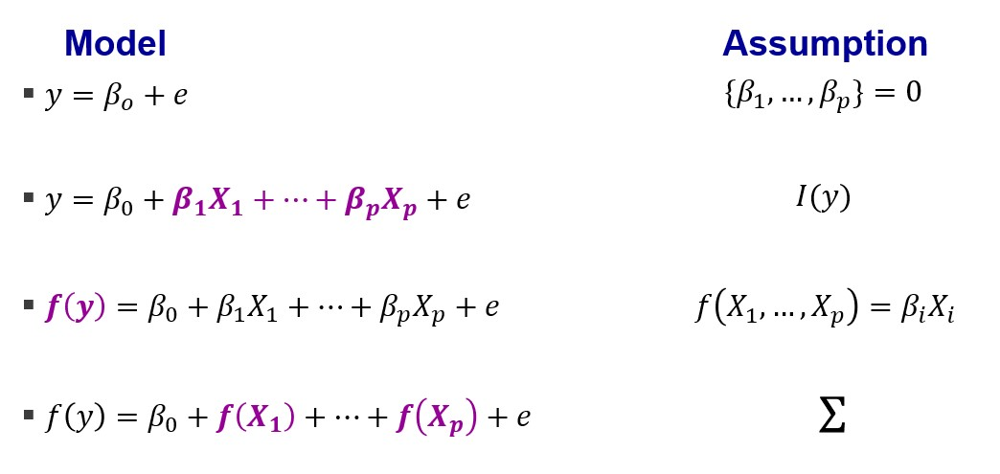

Gaussian Processes (or should I say compilations?)
================
Ciarán McInerney
2023-06-23

#### Requisites

``` r
# Load packages.
library(tidyverse)
library(RobustGaSP)
library(gridExtra)
library(latex2exp)
library(DiceKriging)
# Instantiate shared variables.
sd <- 2
n <- 1000
# Set seed.
set.seed(1)
# Set reusable plot formatting.
plotformatting <-
  theme(panel.grid.major = element_blank(),
        panel.grid.minor = element_blank(), 
        axis.title.x = element_blank(),
        axis.title.y = element_blank(),
        axis.text.x = element_blank(), 
        axis.text.y = element_blank(),
        strip.text = element_blank()
        )
```

## TL;DR

**Say you come across some random variables. Grab a handful, combine
them, and calculate their multivariate distribution. If you get a
multivariate Gaussian distribution for every random handful you grab,
then you have a Gaussian process. This multivariate Gaussian
distribution is informed by random variables, just like how a univariate
distribution is informed by random observations. Distributions of random
variables are useful because, just like we can know something about
unobserved observations from a known univariate distribution, we can
know something about unobserved random variables from a known
distribution of a Gaussian process. Also, we can know something about
their variance. <br/><br/> The relationship between the component random
variables is described by the covariance function. A typical covariance
matrix describes how two random variables relate by summarising how
possible observations from two random variables vary around their
respective means. Very specific, and standard. In contrast, a covariance
function describes how the possible observations of different random
variables relate, and you can pick and choose the relationship.**
<br/><br/> <br/><br/>

## Why?

So, what is the motivation behind Gaussian processes? <br/><br/> Once
upon a time, a South African by the name of Danie G. Krige was trying to
estimate the distribution of gold deposits across an entire region when
all he had to work with were observations of gold from a disparate
sample of boreholes. His work – summarised in [his 1951
publication](https://journals.co.za/doi/epdf/10.10520/AJA0038223X_4792)
entitled “A statistical approach to some basic mine valuation problems
on the Witwatersrand” – was read by the French mathematician Georges
Matheron who developed the ideas and created the field of geostatistics.
Matheron developed a method that provides the
best-linear-unbiased-prediction of interpolated values, which he called
Kriging after Danie G. Krige and his inspiring work.

``` r
par(mar = c(4, 4, .1, .1))


```


Kriging uses Gaussian processes to interpolate values based on some
prior knowledge of how observations covary. For geostatisticians like
Krige and Matheron, it’s about interpolating the likely quantity of
mineral deposits distributed throughout a landscape. Generally, kriging
can be used to interpolate the value of one random variable by having
some (but not necessarily complete) knowledge of how it covaries with
another random variable (in addition to assuming that the unobserved
random variables are merely unobserved components of the multivariate
distribution rather than some other posse of variables). <br/><br/>

### Processes or compilations?

The development of Kriging is a great example of why I think Gaussian
compilations is a more accurate description of Gaussian processes. All
that is required is that we have a set of random variables, but we don’t
need those random variables to be sequential realisations of the same
underlying phenomenon. The only reason they are called Gaussian
processes is because sometimes we want to believe that each random
variable we grab is representing a repeated observation of some latent
variable. In other words, as we proceed, we take further observations
through time. But Danie Krige’s work on mining is more concerned with
compiling random variable across space rather than time - compiling
observations into a map rather than stitching them into a sequence.
<br/><br/> <br/><br/>

## Seriously, what?

Obviously, in the previous sections, I left out some important details,
but it was all in aid of you getting the gist. <br/><br/> First of all,
when I said “*Grab a handful* \[of random variables\] *, combine them*”,
I actually needed you to linearly combine them, i.e. sum them after
multiplying each by some constant. Gaussian processes don’t work
otherwise, which is one of their limitations. Secondly, I didn’t make
clear an essential distinction between distributions of random
observations and distributions of random variables. To explain, I’d like
to evoke Bob Ross and to paint (i.e. plot) some mountains.

``` r

```


<br/><br/>

### Mountain plotter

Let’s say you are shown a mountain asked me to paint it. I’m feeling
entrepreneurial and decide to automate the process because I think more
people will want this kind of painting in the future. Obviously, my
automated mountain painter – which I’ve called mountain plotter – will
need some variability so that I don’t counterfeit my marvelous work!
<br/><br/> For my first attempt, I ask to know the height of the
mountain and how spread out it is. My friend doesn’t know but gives a
rough estimate of both. To plot my first attempt, I use the density of a
univariate Gaussian distribution. These are characterised by a mean and
a variance. The mean will specify the location of the peak,
horizontally, and the variance will inform the sloppiness of the sides.
The height at any given point on the mountain is given by the ‘density’
– i.e. the proportion of observations we would expect at the given
horizontal location; highest in the middle at the mean location, lower
as move away from the mean location.

``` r
myMean <- 5
df_univariate <-
  data.frame(
    var_val = rnorm(n, myMean, sd),
    var_name = as.factor(1)
  )
(p_univar <-
    ggplot(df_univariate) +
    stat_density(aes(x = var_val, linetype = var_name),
                 position = "identity", geom = "line",
                 color = 'grey2', linewidth = 3,
                 show.legend = F) +
    plotformatting
)
```


Importantly, this mountain that I have plotted was generated by
specifying a distribution for ‘mountain heights’ and sampling
observations from it (making it look smooth was just my artistic
license). Another way of saying this is that 1) I’m trying to plot the
entire mountain by 2) sampling from a single distribution. This first
attempt looks pretty good but there isn’t much variability between
paintings when I run the script multiple times. Also, the mountain
doesn’t have a natural shape.

``` r
# Specifiy the mean
myMean <- 5
# Create the plot data.
df_univariate_multiple <-
  data.frame(
    var_val = numeric(),
    var_name = factor()
  )
for (iter in 1:3)
{
  this_var <-
    data.frame(
      var_val = rnorm(n, myMean, sd),
      var_name = as.factor(iter)
    )
  df_univariate_multiple <- dplyr::bind_rows(df_univariate_multiple, this_var)
}
# Plot.
(p_univar_multiple <-
    ggplot(df_univariate_multiple) +
    stat_density(aes(x = var_val),
                 position = "identity", geom = "line",
                 color = 'grey2', linewidth = 2,
                 show.legend = F) +
    facet_wrap(~var_name) +
    plotformatting
)
```


<br/><br/> For my second attempt, I ask to know the height at a handful
of points along the mountain and to know how certain my friend is of
these height estimates. Obviously, knowing all the points would be ideal
but that is too much to ask of my friend and having that information
would limit my mountain plotter to only plot that one mountain.
<br/><br/> When I knew the peak height of the mountain and its variance
in heights, I was able to infer the heights at all points on the
mountain. But how can I infer the heights at all points on the mountain
when all I have are my friend’s guesses of heights at only a few points
along the mountain? Thankfully, Gaussian processes / compilations can
help us do just that, and produce mountain ranges like what I show
below. (*Specifically, I make use of a Gaussian process emulator, which
you can learn more about in [my other
explainer](https://github.com/ciaranmci/SoMaS)*)

``` r
# Extract the plotting data from the plot.
data_p_univar <-
  ggplot2::ggplot_build(p_univar)$data[[1]]
for (i_plot in 1:3)
{
  # Create the plot data.
  GP_data <-
    data_p_univar %>% 
      dplyr::select(x, y) %>%
      dplyr::sample_n(45) %>%
      dplyr::arrange(x)
  # Fit a Gaussian process model, with power exponential kernel.
  model <- RobustGaSP::rgasp(design = GP_data$x,
                             response = GP_data$y,
                             kernel_type = 'pow_exp',
                             alpha = 3)
  testing_input = as.matrix(sort(seq(min(GP_data)*1.1, max(GP_data)*1.1, 1/50)))
  # Prepare plot data.
  df_GP <-
    data.frame(
        testing_input = testing_input,
        model_prediction = predict(model, testing_input)
      )
  # Plot
  assign(
    paste0("p_GP", i_plot),
    df_GP %>%
      ggplot(aes(x = testing_input,
                 y = model_prediction.mean)) +
      geom_line(color = "grey2", linewidth = 3,
                show.legend = F) +
      xlim(2, 10) + ylim(0, 0.2) +
      plotformatting
  )
  
      
}
# Final plotting.
gridExtra::grid.arrange(p_GP1, p_GP2, p_GP3,
                        ncol = 3)
```


So, how did I go from a single, isolated peak to an interacting mountain
range? <br/><br/> <br/><br/>

## How?

As I said earlier, my first attempt at plotting a mountain used a
single, univariate distribution. The plot was the result of asking *How
high can I expect each point on the mountain to be if I assume the
height of any given point on the mountain is expected to be* $\mu$ *with
some uncertainty* $\sigma^2$*?* By taking this approach, I inferred the
unobserved heights at various points on the mountain by knowing only the
overall expected height (i.e. the mean) and how heights at all point
relate to it (i.e. variance). <br/><br/> In contrast, my second attempt
at plotting a mountain used multiple univariate distributions that were
neatly described by a single, multivariate distribution - i.e. a
Gaussian process / compilation. The plot was the result of asking a
different question: *How high can I expect each point on the mountain to
be if I assume the height of each point has its own expected value*
$\mu_{point}$ *with its own uncertainty* $\sigma_{point}^2$ *, and I
only observe a handful of these?* <br/><br/> Crucially, I didn’t specify
the expected heights and uncertainties for each point on the mountain.
Instead, I used only a handful of expected heights while also specifying
how each height on the mountain relates to another. By doing so, I
inferred unobserved expected heights and their uncertainty rather than
merely inferring unobserved heights from a single random variable.
<br/><br/> This can be visualised with something as simple as box plots.

### More, more, more

I assume you have seen box plots before. It is an example of a
distributional plot, just like barcode plots and [violin
plots](https://chartio.com/learn/charts/violin-plot-complete-guide/).
Let’s start really small and plot the distributions of three categorical
variables. The plot below shows the distributions as familiar box plots,
but also as (what I call) barcode plots.

``` r
# Specify the heights of the barcode plots.
heights <- c(5, 20, 5)
# Create the plot data.
df_barcode <-
  data.frame(
    val = numeric(),
    group = factor()
  )
for (iter in 1:3)
{
  this_var <-
    data.frame(
      val = rnorm(n / 10, heights[iter], sd),
      group = as.factor(iter)
    )
  df_barcode <- dplyr::bind_rows(df_barcode, this_var)
}
(df_barcode %>%
  ggplot(aes(x = group, y = val)) + 
  geom_boxplot(
    width = 0.25, 
    outlier.shape = NA) +
  geom_point(
    shape = 95,
    size = 10,
    alpha = 0.2) + 
    plotformatting
  )
```


We are used to seeing these kinds of visualisations. They tell us that
there are multiple values (shown vertically) associated with multiple
categories (shown horizontally). <br/><br/> Now, let’s increase the
number of categories. I’ll drop the boxplots and only show the barcode
plots.

``` r
# Specify the heights of the barcode plots.
heights <- c(5, 7, 10, 14, 20, 18, 14, 10, 7, 5)
# Create the plot data.
df_barcode <-
  data.frame(
    val = numeric(),
    group = factor()
  )
for (iter in 1:10)
{
  this_var <-
    data.frame(
      val = rnorm(n / 10, heights[iter], sd),
      group = as.factor(iter)
    )
  df_barcode <- dplyr::bind_rows(df_barcode, this_var)
}
(df_barcode %>%
  ggplot(aes(x = group, y = val)) + 
  geom_point(
    shape = 95,
    size = 10,
    alpha = 0.2) + 
    plotformatting
  )
```


Again, no problems here; it’s all very familiar. The variable being
represented by the categories on the horizontal axis appears to have a
lot of categories and each category has a lot of vertical values.
<br/><br/> Now, let’s push this to the ridiculous end of the spectrum.
Fancy 80 categories?

``` r
# Set number of categories.
cats <- 80
# Specify the heights of the barcode plots.
heights <-
  ggplot2::ggplot_build(p_univar)$data[[1]] %>%
  dplyr::select(x, y) %>%
  dplyr::sample_n(cats) %>%
  arrange(x, y) %>%
  dplyr::select(y) %>%
  as.matrix()*100
# Create the plot data.
df_barcode <-
  data.frame(
    val = numeric(),
    group = factor()
  )
for (iter in 1:cats)
{
  this_var <-
    data.frame(
      val = rnorm(n / 10, heights[iter], sd),
      group = as.factor(iter)
    )
  df_barcode <- dplyr::bind_rows(df_barcode, this_var)
}
(df_barcode %>%
  ggplot(aes(x = group, y = val)) + 
  geom_point(
    shape = 95,
    size = 10,
    alpha = 0.2) + 
    plotformatting
  )
```


It’s all blurring together - like a blurry view of a mountain through
the haze. Now you see that I wasn’t plotting multiple values for any
arbitrary categories; I was plotting multiple height values for
locations along a mountain range. <br/><br/> Looking at a plot like the
one immediately above, you might start to think that the variable on the
horizontal axis has so many values that it might be wise to model it as
a continuous variable. Voila! You now have a way to conceptualise
Gaussian processes / compilations: infinitely many distributional plots.
In fact, I created the previous plot by sampling density values from our
univariate Gaussian distribution, using each density value (i.e. height)
as the mean for a Gaussian distribution, then plotting them with barcode
plots. <br/><br/> (*Side note: I choose to visualise the plot using many
discrete horizontal values rather than a continuous one because I think
it better illustrates the approaching-infinite behaviour of what
Gaussian processes / compilations do*.) <br/><br/> If you look at the
plots below from left to right, you can see how I generated the
Gaussian-process mountain ranges from earlier (the right-most one):

``` r
## Sample some height data.
df_sample<-
  data_p_univar %>% 
  dplyr::select(x, y) %>%
  dplyr::sample_n(100) %>%
  dplyr::arrange(x)
# Create the plot data.
df_blurry <-
  data.frame(
    val = numeric(),
    group = numeric()
  )
for (iter in 1:100)
{
  this_var <-
    data.frame(
      val = rnorm(n / 10, df_sample$y[iter]*100, sd),
      group = df_sample$x[iter]
    )
  df_blurry <- dplyr::bind_rows(df_blurry, this_var)
}
# Make component plot `df_blurry`.
p_blurry <-
    ggplot() +
    geom_point(
      data = df_blurry,
      aes(x = group, y = val),
      shape = 95,
      size = 10,
      alpha = 0.2) +
    plotformatting
# Make component plot `overlay`.
p_overlay <-
  p_blurry +
  geom_line(data = df_GP,
            aes(x = testing_input,
                y = model_prediction.mean*100),
            color = "white", linewidth = 3,
            show.legend = F) +
  plotformatting
# Final plotting.
gridExtra::grid.arrange(p_univar + xlim(2, 10) + ylim(0, 0.25),
                        p_blurry + xlim(2, 10) + ylim(0, 25),
                        p_overlay + xlim(2, 10) + ylim(0, 25),
                        p_GP3 + xlim(2, 10) + ylim(0, 0.25),
                        ncol = 4)
```


In the four-plot visualisation above, I did the following:

1.  I started with a mountain generated using my univariate approach.
    Each data point represents a height. With your mathematics hat on,
    you can think of this as a plot of mountain height as a function of
    horizontal location.

2.  I considered each point along the mountain to be the mean of its own
    Gaussian distribution of height at that horizontal location. This
    produced the blurry view, like a mountain through the haze.

3.  I fit a Gaussian process emulator to the blurry mountain range data,
    which, essentially, tried to ‘learn’ the set of all functions that
    could pass through the data points. I then predicted the mean
    function’s values along the width of the mountain range, which is
    the white line in the third image. (Note: The white line might not
    match up with the centre of each barcode plot because the barcode
    plots are only a sample of observations from each distribution.)

4.  Finally, I plotted only the series of the mean function’s values
    outputted from the emulator. <br/><br/>

As I mentioned earlier, if you want to learn more about Gaussian
processs emulators, check out [my other
explainer](https://github.com/ciaranmci/SoMaS). <br/><br/>

### Covariance functions

In the previous visualisation, I showed the four steps I took to produce
a smooth mountain range. I chose the mean predicted values from the
distributions, which produced something quite smooth. But there are
actually infinitely-many curves / functions / mountain ranges that would
satisfy the distributions of heights at each point on the mountain
range. For example, I might not care at all about smoothness and opt to
model the mountain range as a discontinuous function of randomly sampled
heights at each point:

``` r
# Randomly sample from each random variable.
df_jaggedy <-
  df_blurry %>%
  group_by(group) %>%
  dplyr::sample_n(1)
# Plot.
(p_jaggedy <-
  p_blurry +
  geom_line(data = df_jaggedy,
            aes(x = group,
                y = val),
            color = "white", linewidth = 3,
            show.legend = F) +
  plotformatting)
```


This looks impossibly jaggedy for a real mountain range. That is because
I choose the heights at each horizontal location without considering the
heights of the mountain around it. Although cliffs and crevasses can
exist, we wouldn’t expect them this frequently. To plot a more-realistic
mountain, we need to incorporate some kind of correlation between
heights along the mountain. This is done with a covariance matrix. For
my smooth plot, I specified the correlation between points using the
following formula, where $d$ is the difference in horizontal location of
each height (i.e. $h_{x}$ and $h_{x^{\prime}}$), and $\gamma$ is a
parameter for the range over which I want the correlation to take
effect: $$
C(x, x^{\prime})= exp \left( - \left( \frac{d}{\gamma} \right) ^2 \right)
$$ Of course, I could have made a jaggedy mountain range by using this
same covariance function but with different values for the $\gamma$
parameter.

``` r
# Fit a Gaussian process model using the same sample data and covariance matrix
# as the one to which I will be comparing, but change the length-scale parameter.
model <- RobustGaSP::rgasp(design = GP_data$x,
                           response = GP_data$y,
                           kernel_type = 'pow_exp',
                           alpha = 0.08)
testing_input = as.matrix(sort(seq(min(GP_data)*1.1, max(GP_data)*1.1, 1/50)))
# Prepare plot data.
df_GP_jaggedy <-
  data.frame(
      testing_input = testing_input,
      model_prediction = predict(model, testing_input)
    )
# Make component plot for `jagged_overlay`.
p_jagged_overlay <-
  p_blurry +
  geom_line(data = df_GP_jaggedy,
            aes(x = testing_input,
                y = model_prediction.mean*100),
            color = "white", linewidth = 3,
            show.legend = F) +
  plotformatting

# Final plotting.
gridExtra::grid.arrange(p_overlay + xlim(2, 10) + ylim(0, 25) + ggtitle('Smooth covariance\n matrix'),
                        p_jagged_overlay + xlim(2, 10) + ylim(0, 25) + ggtitle('Jaggedy covariance\n matrix'),
                        p_jaggedy + xlim(2, 10) + ylim(0, 25) + ggtitle('Jaggedy from\n random sampling'),
                        ncol = 3)
```


The jaggedy version made using a covariance matrix is notably
less-jagged than the jaggedy version made using random sampling. This
isn’t surprising given that enforcing any correlation between heights
points will smooth things out. <br/><br/>

### But what is a covariance function?

One way to think about it is to compare covariance functions with
covariance matrices. A covariance matrix describes how two random
variables relate by summarising how possible observations from two
random variables vary around their respective means. Very specific, and
standard. In contrast, a covariance function describes how the possible
observations of different random *variables* relate, and you can
pick-and-choose the relationship. <br/><br/> Covariance functions are
also called kernels because they perform the kernel trick, just like for
support vector machines. A quick explanation of kernels goes something
like this:

1.  models can be used to map input values to output values.

2.  representing the relationship between inputs and outputs can be as
    simple or as complicated as you like.

3.  the complications can either be incorporated via the modelling -
    e.g. a big messy logistic regression or a neural network model - or
    via a transformation of the inputs before applying a simpler model -
    e.g. kernels in for support vector machines or covariance functions
    for Gaussian process models.

Essentially, kernel tricks like the covariance functions are an
additional model that we add to our main model that relates the inputs
to the outputs. There are many common covariance functions that you can
check out on [the wikipedia
page](https://en.wikipedia.org/wiki/Gaussian_process#Usual_covariance_functions),
but you could just invent your own, if you like. For my smooth mountain
range, I used an exponential covariance function that was inspired from
models of [volcanic
hazards](http://www2.stat.duke.edu/~berger/papers/volcano.pdf)! This
covariance function happened to have a roughness parameter, $\alpha$
,that I could tweak to smooth out the ridge lines between my mountain
peaks (see [the RobustGaSP
paper](https://journal.r-project.org/archive/2019/RJ-2019-011/RJ-2019-011.pdf)
for details of the `RobustGaSP::rgasp()` function in R). <br/><br/>

## Final thoughts and other resources

Gaussian processes - or as I like to call them, “compilations” - are an
example of making clever use of a pattern to infer details. The pattern
is multivariate Gaussian distributions and the details are the values of
the component random variables that you don’t observe. This has been put
to great use in Gaussian process regression. I encourage you to check
out [this video](https://www.youtube.com/watch?v=UBDgSHPxVME) for a
python tutorial in building a Gaussian process regression model.
Hopefully, after reading this blog, you will understand what the
developer is talking about. Be aware that many people say “Gaussian
processes” when they are actually talking about Gaussian process
regression, e.g. [Mutual
Information](https://www.youtube.com/@Mutual_Information)’s
beautifully-visualised [video on “Gaussian
processes”](https://www.youtube.com/watch?v=UBDgSHPxVME)). <br/><br/>
But Gaussian processes / compilations aren’t perfect. Gaussian processes
require that the multivariate Gaussian distribution arises for any
linear predictor of component random variables that are Gaussian
distributed. Linear predictors are handy mathematical objects but there
is nothing inherently more correct or representative about them than
other ways of combining random variables. Below is snippet of a slide I
show my students to reveal what assumptions we make when we specify some
linear-predictor models:

``` r

```


<br/><br/> As you can see, summing the random variables is only an
assumption and is not set in stone. [Nardo et
al.](https://www.oecd.org/sdd/42495745.pdf) would consider the outputs
of linear predictors to be “*composite indicators*” and, therefore,
potentially victim to issues of compensability. Perhaps multiplying the
random variables would be more appropriate, particularly when the output
is used for ranking. But multiplying Gaussian distributions provides a
lognormal distribution rather than a multivariate Gaussian, so the
theory of Gaussian processes / compilations don’t apply. <br/><br/> As
the legendary [Donella ‘Dana’ Meadows](https://donellameadows.org/) once
said, [“*the worst assumptions…are the ones that got left
out*”](https://www.youtube.com/watch?v=XL_lOoomRTA). What are we
assuming about the random variables when we assume they combine in a
linear predictor? What does the summation of a linear predictor
mean/represent in reality? <br/><br/> It seems appropriate to quote
Donella Meadows again when it comes to linear predictions. In her book,
[Thinking in Systems: A
primer](https://donellameadows.org/systems-thinking-book-sale/), Meadows
says “*You think that because you understand ‘one’ that you must
therefore understand ‘two’ because one and one make two. But you forget
that you must also understand ‘and’.*” <br/><br/> <br/><br/>

### Resources

1.  For a great, interactive explainer of Gaussian processes, look no
    further than [Görtler, Kehlbeck, and Deussen’s
    blog](https://distill.pub/2019/visual-exploration-gaussian-processes/)
    from [distill.pub](https://distill.pub) publications.

2.  [distill.pub](https://distill.pub) publications also have a blog by
    [Agnihotri and
    Batra](https://distill.pub/2020/bayesian-optimization/) on Bayesian
    optimization that pays homage to Krige’s initial work.
