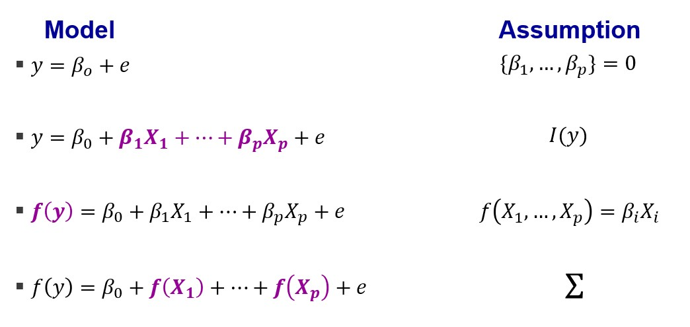

```{r setup, include=FALSE}
knitr::opts_chunk$set(echo = TRUE)
```

#### Requisites
```{r Requisites, warning = FALSE, message = FALSE}
# Load packages.
library(tidyverse)
library(RobustGaSP)
library(ggdist)
library(gridExtra)
# Instantiate shared variables.
sd <- 2
n <- 1000
# Set seed.
set.seed(1)
# Set reusable plot formatting.
plotformatting <-
  theme(panel.grid.major = element_blank(),
        panel.grid.minor = element_blank(), 
        axis.title.x = element_blank(),
        axis.title.y = element_blank(),
        axis.text.x = element_blank(), 
        axis.text.y = element_blank(),
        strip.text = element_blank()
        )
```

## TL;DR
**Say you come across some random variables. Grab a handful, add them, and calculate their multivariate distribution. If you get a multivariate distribution for every random handful you grab, then you have a Gaussian process. This multivariate distribution is informed by random variables, just like how a univariate distribution is informed by random observations. Distributions of random variables are useful because, just like we can know something about unobserved observations from a known univariate distribution, we can know something about unobserved random variables from a known distribution of a Gaussian process.
<br/><br/>
The relationship between the component random variables is described by the covariance function. While a covariance matrix summarises how possible observations from two random variables vary around their respective means, a covariance function summarises how the possible means of random variables vary around the multivariate mean.**
<br/><br/>
<br/><br/>

## Why?
So, what is the motivation behind Gaussian processes?
<br/><br/>
Once upon a time, a South African by the name of Danie G. Krige was trying to estimate the distribution of gold deposits across an entire region when all he had to work with were observations of gold from a disparate sample of boreholes. His work – summarised in [his 1951 publication](https://journals.co.za/doi/epdf/10.10520/AJA0038223X_4792)  entitled “A statistical approach to some basic mine valuation problems on the Witwatersrand” – was read by the French mathematician Georges Matheron who developed the ideas and created the field of geostatistics. Matheron developed a method that provides the best-linear-unbiased-prediction of interpolated values, which he called Kriging after Danie G. Krige and his inspiring work.
<br/><br/>

```{r, figures-side, fig.show="hold", out.width="20%", fig.align = "center", fig.cap="(Left) Danie Krige, namesake of 'Kriging'. (Right) Georges Matheron, who developed Danie Krige's work."}
par(mar = c(4, 4, .1, .1))


```

Kriging uses Gaussian processes to interpolate values based on some prior knowledge of how observations covary. For geostatisticians like Krige and Matheron, it’s about interpolating the likely quantity of mineral deposits distributed throughout a landscape. Generally, kriging can be used to interpolate the value of one random variable by having some (but not necessarily complete) knowledge of how it covaries with another random variable (in addition to assuming that the unobserved random variables are merely unobserved components of the multivariate distribution rather than some other posse of variables).

### Processes or compilations?
The development of Kriging is a great example of why I think Gaussian compilations is a more accurate description of Gaussian processes. All that is required is that we have a set of random variables, but we don’t need those random variables to be sequential realisations of the same underlying phenomenon. The only reason they are called Gaussian processes is because sometimes we want to believe that each random variable we grab is representing a repeated observation of some latent variable. In other words, as we proceed, we take further observations through time. But Danie Krige's work from mining more concerned with compiling random variable across space rather than time.
<br/><br/>
<br/><br/>

## Seriously, what?
Obviously, in the previous sections, I left out some important details, but it was all in aid of you getting the gist.

First of all, when I said “_Grab a handful_ [of random variables] _, add them_”, I actually needed you to linearly combine them, i.e. sum them after multiplying them by some constant. Gaussian processes don’t work otherwise, which is one of their limitations.
Secondly, I didn’t make clear an essential distinction between distributions of random observations and distributions of random variables. To explain, I'd like to evoke Bob Ross and to paint (i.e. plot) some mountains.

```{r, out.width="50%", fig.align = "center", fig.cap="A delightful Bob Ross with one of his paintings."}

```
<br/><br/>

### Mountain plotter
Let’s say you asked me to paint a mountain landscape. I’m feeling entrepreneurial and decide to automate the process because I think more people will want this kind of painting in the future. Obviously, my automated mountain painter – which I’ve called mountain plotter – will need some variability so that I don’t counterfeit my marvellous work!

My first attempt might be to use a typical univariate Gaussian distribution. These are characterised by a mean and a variance. The mean will specify the location of the peak, horizontally, and the variance will inform the sloppiness of the sides. The height at any given point on the mountain is given by the ‘density’ – i.e. the proportion of observations we would expect at the given horizontal location; highest in the middle at the mean location, lower as move away from the mean location.

```{r One univariate, out.width="50%", fig.align = "center", fig.height = 3}
myMean <- 5
df_univariate <-
  data.frame(
    var_val = rnorm(n, myMean, sd),
    var_name = as.factor(1)
  )
(p_univar <-
    ggplot(df_univariate) +
    stat_density(aes(x = var_val, linetype = var_name),
                 position = "identity", geom = "line",
                 color = 'grey2', linewidth = 3,
                 show.legend = F) +
    plotformatting
)
```
<br/><br/>
<br/><br/>

My first attempt looks pretty good but there isn’t much variability between paintings when I run the script multiple times:
```{r Three univariates, fig.align = "center", fig.height = 2}
# Specifiy the mean
myMean <- 5
# Create the plot data.
df_univariate_multiple <-
  data.frame(
    var_val = numeric(),
    var_name = factor()
  )
for (iter in 1:3)
{
  this_var <-
    data.frame(
      var_val = rnorm(n, myMean, sd),
      var_name = as.factor(iter)
    )
  df_univariate_multiple <- dplyr::bind_rows(df_univariate_multiple, this_var)
}
# Plot.
(p_univar_multiple <-
    ggplot(df_univariate_multiple) +
    stat_density(aes(x = var_val),
                 position = "identity", geom = "line",
                 color = 'grey2', linewidth = 2,
                 show.legend = F) +
    facet_wrap(~var_name) +
    plotformatting
)
```
<br/><br/>
<br/><br/>

To add more variety, I could add more peaks. For this, I might use mixture distributions, which are nothing more complicated than drawing multiple peaks by specifying multiple means for multiple univariate Gaussian distributions. It looks something like this:
```{r Three mixtures of three, fig.align = "center", fig.height = 2}
# Specify the vector of means.
v_means <- c(5, 15, 25)
# Create the plot data.
df_mixture <- 
  data.frame(
    var_val = numeric(),
    var_name = factor(),
    trial = factor()
  )
for (i_trial in 1:3)
{
  for (i_var in 1:length(v_means))
  {
    this_var <-
      data.frame(
        var_val = rnorm(n, v_means[i_var], sd),
        var_name = as.factor(i_var),
        trial = as.factor(i_trial)
      )
    df_mixture <- dplyr::bind_rows(df_mixture, this_var)
  }
  
}
# Plot.
(p_mixture <-
  ggplot(df_mixture) +
  stat_density(aes(x = var_val, linetype = var_name),
               position = "identity", geom = "line",
               color = 'grey', linewidth = 1,
               show.legend = F) +
  stat_density(aes(x = var_val, alpha = var_name),
               position = "stack", geom = "line",
               color = "grey2", linewidth = 2,
               show.legend = F) +
  scale_alpha_manual(values = c(1, rep(0, length(v_means)))) +
  facet_wrap(~trial) +
  plotformatting
)
```
<br/><br/>
<br/><br/>


With mixture distributions, we are independently generating samples from each of the univariate distributions and overlaying the results on the same plot. In the figure above, it’s almost like we are just throwing a blanket over the top of the three univariate distributions and it is sagging between the peaks. If we pick a point at some height on our mountain range (the black line), we can see that it is just the sum of the overlapping, underlying univariate distributions.
```{r Layering the mixture, fig.align = "center", fig.height = 3}

```
<br/><br/>
<br/><br/>

Unfortunately, there is still not much variation between peaks, and this mountain range doesn’t look realistic; especially not one with peaks so close together. Instead, we’d expect some higher ridges between the peaks. I mean, look at Bob Ross’ masterpiece.

```{r Bobs mountains, out.width="50%", fig.align = "center"}

```
<br/><br/>

When I say that we would expect higher ridges between the peaks, I’m saying that we would expect the land between the peaks to have stronger correlation with the peaks either side; if the peaks are high, the ridge line is likely to stay high. But we can’t just change the height of a point in our plotted mountain range because the heights are given by the density from underlying, univariate Gaussian distributions.
<br/><br/>
We need to think differently. We need to think of a method that allows for the following two things:

1.	At each location horizontally, we need to be able to choose from a range of possible heights so that we can match with neighbouring points, and

2.	We need some way of encoding the relationship between neighbouring points on the mountain range.

Hmm, What method might work?

```{r Thinking Sherlock, fig.align = "center"}
knitr::include_graphics("https://media.giphy.com/media/fv8KclrYGp5dK/giphy.gif")
```
<br/><br/>
<br/><br/>

Thankfully, Gaussian processes / compilations can help us do just that, and produce a mountain range like what I show below. Specifically, I make use of a Gaussian process emulator, which you can learn more about in [my other explainer]():
```{r GP mountain range, out.width="50%", fig.align = "center", results='hide', warning = FALSE}
# Specify the data.
GP_data <-
  df_mixture  %>%
  dplyr::filter(trial == 1)
# Define but don't show the plot of the blanket over top.
p_mixture_blanket <-
  ggplot(GP_data) +
  stat_density(aes(x = var_val, alpha = var_name),
               position = "stack", geom = "line", show.legend = F) +
  scale_alpha_manual(values = c(1, rep(0, length(v_means))))
# Extract the plotting data from the plot.
data_p_mixture_blanket <-
  ggplot2::ggplot_build(p_mixture_blanket)$data[[1]]
# Create the plot data.
GP_data <-
  data_p_mixture_blanket %>% 
    dplyr::filter(alpha == 1) %>%
    dplyr::select(x, y) %>%
    dplyr::sample_n(45) %>%
    dplyr::arrange(x)
# Fit a Gaussian process model, with power exponential kernel.
model <- RobustGaSP::rgasp(design = GP_data$x,
                           response = GP_data$y,
                           kernel_type = 'pow_exp',
                           alpha = 3)
testing_input = as.matrix(sort(seq(-5, 35, 1/50)))
# Prepare plot data.
df_GP <-
  data.frame(
      testing_input = testing_input,
      model_prediction = predict(model, testing_input)
    )
# Plot
(p_GP <-
    df_GP %>%
    ggplot(aes(x = testing_input,
               y = model_prediction.mean)) +
    geom_line(color = "grey2", linewidth = 3,
              show.legend = F) +
    xlim(3,30) +
    plotformatting
)
```
<br/><br/>
<br/><br/>

So, how did I go from a single, isolated peak to an interacting range of mountains? The difference comes down to a crucial distinction between mixture distributions and Gaussian processes / compilations.
<br/><br/>
<br/><br/>

## How?
To plot the mountain range using a mixture distribution, I brought together some random variables and added their heights at each point along the horizontal. This sounds a bit like my description of a Gaussian process / compilation – i.e. “Grab a handful [of random variables], add them”– but there is a crucial difference: dependency.

For the mixture distribution plot, the height at each horizontal location is the sum of heights given by sampling from each individual, underlying distribution. For the Gaussian process / compilation, the height at each horizontal location is sampled from its own distribution.

That’s right: each point in our one-dimensional example has its own distribution because the height at each horizontal location is its own random variable. This is what I meant when I said “Grab a handful [of random variables], add them”. I led you astray by combining only three random variables for the mixture distribution; Gaussian processes / compilations assume infinitely many random variables for each point along a continuous scale (in our case, the horizontal location). This might seem like a mad and unfathomable notion but I bet you’ve seen something like this before.
<br/><br/>

### Just add more
Let’s start really small and plot the distributions of three categorical variables. The plot below shows the distributions as familiar box plots, but also as (what I call) barcode plots.

```{r Three barcode plots, out.width="50%", fig.align = "center", results='hide', warning = FALSE}
# Specify the heights of the barcode plots.
heights <- c(5, 20, 5)
# Create the plot data.
df_barcode <-
  data.frame(
    val = numeric(),
    group = factor()
  )
for (iter in 1:3)
{
  this_var <-
    data.frame(
      val = rnorm(n / 10, heights[iter], sd),
      group = as.factor(iter)
    )
  df_barcode <- dplyr::bind_rows(df_barcode, this_var)
}
(df_barcode %>%
  ggplot(aes(x = group, y = val)) + 
  geom_boxplot(
    width = 0.25, 
    outlier.shape = NA) +
  geom_point(
    shape = 95,
    size = 10,
    alpha = 0.2) + 
    plotformatting
  )
```

We are used to seeing these kinds of visualisations. They tell us that there are multiple values (shown vertically) associated with multiple categories (shown horizontally).
<br/><br/>
Now, let’s increase the number of categories. I'll drop the boxplots and only show the barcode plots.
```{r Ten barcode plots, out.width="50%", fig.align = "center", results='hide', warning = FALSE}
# Specify the heights of the barcode plots.
heights <- c(5, 7, 10, 14, 20, 18, 14, 10, 7, 5)
# Create the plot data.
df_barcode <-
  data.frame(
    val = numeric(),
    group = factor()
  )
for (iter in 1:10)
{
  this_var <-
    data.frame(
      val = rnorm(n / 10, heights[iter], sd),
      group = as.factor(iter)
    )
  df_barcode <- dplyr::bind_rows(df_barcode, this_var)
}
(df_barcode %>%
  ggplot(aes(x = group, y = val)) + 
  geom_point(
    shape = 95,
    size = 10,
    alpha = 0.2) + 
    plotformatting
  )
```

Again, no problems here; it’s all very familiar. The variable being represented by the categories on the horizontal axis appears to have a lot of categories and each category has a lot of vertical values.
<br/><br/>
Now, let’s push this to the ridiculous end of the spectrum. Fancy 80 categories?
```{r Eighty barcode plots, out.width="50%", fig.align = "center", results='hide', warning = FALSE}
# Set number of categories.
cats <- 80
# Specify the heights of the barcode plots.
heights <-
  ggplot2::ggplot_build(p_univar)$data[[1]] %>%
  dplyr::select(x, y) %>%
  dplyr::sample_n(cats) %>%
  arrange(x, y) %>%
  dplyr::select(y) %>%
  as.matrix()*100
# Create the plot data.
df_barcode <-
  data.frame(
    val = numeric(),
    group = factor()
  )
for (iter in 1:cats)
{
  this_var <-
    data.frame(
      val = rnorm(n / 10, heights[iter], sd),
      group = as.factor(iter)
    )
  df_barcode <- dplyr::bind_rows(df_barcode, this_var)
}
(df_barcode %>%
  ggplot(aes(x = group, y = val)) + 
  geom_point(
    shape = 95,
    size = 10,
    alpha = 0.2) + 
    plotformatting
  )
```

It's all blurring together - like a blurry view of a mountain.
At this point, you might start to think that the variable on the horizontal axis has so many values that it might be wise to model it as a continuous variable. Voila! You now have a way to conceptualise Gaussian processes / compilations: infinitely many distributional plots. In fact, I created the previous plot by sampling density values from our univariate Gaussian distribution, using each density value (i.e. height) as the mean for a Gaussian distribution, then plotting them with barcode plots.
<br/><br/>
Also, looking at the plots below from left to right, you can see how I generated the Gaussian-process mountain range from earlier:
```{r Making of GP mountain range, fig.align = "center", results='hide', warning = FALSE}
## Sample some height data.
df_sample_mixture_blanket <-
  data_p_mixture_blanket %>%
  dplyr::filter(alpha == 1) %>%
  dplyr::select(x, y) %>%
  dplyr::filter(x > 3 & x < 30) %>%
  dplyr::sample_n(100) %>%
  arrange(x)
# Create the plot data.
df_blurry_mixture_blanket <-
  data.frame(
    val = numeric(),
    group = numeric()#factor()
  )
for (iter in 1:100)
{
  this_var <-
    data.frame(
      val = rnorm(n / 10, df_sample_mixture_blanket$y[iter]*100, sd),
      group = df_sample_mixture_blanket$x[iter]
    )
  df_blurry_mixture_blanket <- dplyr::bind_rows(df_blurry_mixture_blanket, this_var)
}
# Make component plot `p_blurry_mixture_blanket`.
p_blurry_mixture_blanket <-
    ggplot() +
    geom_point(
      data = df_blurry_mixture_blanket,
      aes(x = group, y = val),
      shape = 95,
      size = 10,
      alpha = 0.2) +
    plotformatting
# Make component plot `overlay`.
p_overlay <-
  p_blurry_mixture_blanket +
  geom_line(data = df_GP,
            aes(x = testing_input,
                y = model_prediction.mean*100),
            color = "white", linewidth = 3,
            show.legend = F) +
  xlim(3,30) +
  plotformatting
# Final plotting.
gridExtra::grid.arrange(p_mixture_blanket + plotformatting,
                        p_blurry_mixture_blanket + ylim(0, 25),
                        p_overlay + ylim(0, 25),
                        p_GP + ylim(0, 0.25),
                        ncol = 4)
```
<br/><br/>
<br/><br/>

In the four-plot visualisation above, you can see that I:

1. started with the 'blanket' mountain range from our mixture distribution, where each data point represents a height;

2. considered each point along the mountain range to be a Gaussian distribution centred at the height data points, which produces the blurry view;

3. fit a Gaussian process emulator to the blurry mountain range data and predicted the mean values of the selected samples along the width of the mountain range;

4. plotted only the series of mean values outputted from the emulator prediction.
<br/><br/>

As I mentioned earlier, if you want to learn more about Gaussian processs emulators, check out [my other explainer]().
<br/><br/>
<br/><br/>

## Covariance functions
In the previous visualisation, I showed the four steps I took to produce a smooth mountain range (plot 4; right-most). I chose the mean predicted values from the distributions, which produced something quite smooth. But there are actually infinitely-many curves / functions / mountain ranges that would satisfy the distributions of heights at each point on the mountain range. For example, I might not care at all about smoothness and opt to model the mountain range as a discontinuous function of randomly sampled heights at each point:

```{r Jaggedy sampling, out.width="50%", fig.align = "center", results='hide', warning = FALSE}
# Randomly sample from each random variable.
df_jaggedy <-
  df_blurry_mixture_blanket %>%
  group_by(group) %>%
  dplyr::sample_n(1)
# Plot.
(p_jaggedy <-
  p_blurry_mixture_blanket +
  geom_line(data = df_jaggedy,
            aes(x = group,
                y = val),
            color = "white", linewidth = 3,
            show.legend = F) +
  xlim(3,30) +
  plotformatting)
```

Alternatively, I might prefer to take a bigger-picture approach and choose a different covariance function to achieve the same kind of jaggediness:
```{r Jaggedy covariance function, out.width="50%", fig.align = "center", results='hide', warning = FALSE}
# Fit a new GPE using parameters to make things really jaggedy, like Brownian 
# motion. Unforunately, RobustGaSP and dgpsi both have limited kernels. The
# DiceKriging package might provide the option to specify my own kernel: https://www.rdocumentation.org/packages/DiceKriging/versions/1.6.0/topics/km

```

not care at all about smoothness and opt to model the mountain range as a discontinuous function of randomly sampled heights at each point:
<br/><br/>
<br/><br/>

Comparing this jaggedy plot to the previous one, you might be wondering how the line produced by the mean of predicted values is so much smoother than the line produced by randomly sampling from each variable along the horizontal. The answer is that I *chose* the _covariance function_ that told my Gaussian process model how the random variables relate. My choice of covariance function was independent of the true relationships between the random variables that fed my model. This meant I could change the form of the mountain range to whatever I want but choosing a different covariance function. The choice of covariance function is strongly influential on the possible set of functions that will be returned.
<br/><br/>

So, I said the relationship between the component random variables is described by the covariance function, but what is a covariance function? While a covariance matrix summarises how possible observations from two random variables vary around their respective means, a covariance function summarises how the possible means of random variables vary around the multivariate mean.
<br/><br/>


Covariance functions are also called kernels because they perform the kernel trick, just like for support vector machines. A quick explanation of kernels goes something like this:

1. models can be used to map input values to output values.

2. representing the relationship between inputs and outputs can be as simple or as complicated as you like.

3. the complications can either be incorporated via the modelling - e.g. a big messy logistic regression or a neural network mdoel - or via a transformation of the inputs before applying a simpler model - e.g. kernels in for support vector machines or covariance functions for Gaussian process models.

Essentially, kernel tricks like the covariance functions are an additional model that we add to our main model that relates the inputs to the outputs. There are many common covariance functions that you can check out on [the wikipedia page](https://en.wikipedia.org/wiki/Gaussian_process#Usual_covariance_functions), but you could just invent your own, if you like. For my smooth mountain range, I used an exponential covariance function that was inspired from models of [volcanic hazards](http://www2.stat.duke.edu/~berger/papers/volcano.pdf)! This covariance function happened to have a roughness parameter, $\alpha$ ,that I could tweak to smooth out the ridge lines between my mountain peaks (see [the RobustGaSP paper](https://journal.r-project.org/archive/2019/RJ-2019-011/RJ-2019-011.pdf) for details of the `RobustGaSP::rgasp()` function in R):
<br/><br/>
<br/><br/>

## Final thoughts and other resources
Gaussian processes require that the multivariate Gaussian distribution arises for any linear predictor of component random variables that are Gaussian distributed. Linear predictors are handy mathematical objects but there is nothing inherently more correct or representative about them than other ways of combining random variables. Below is snippet of a slide I show my students to reveal what assumptions we make when we specify some linear-predictor models:
```{r, out.width="50%", fig.align = "center", fig.cap="A delightful Bob Ross with one of his paintings."}

```
<br/><br/>
 
As you can see, summing the random variables is only an assumption and is not set in stone. [Nardo et al.](https://www.oecd.org/sdd/42495745.pdf) would consider the outputs of linear predictors to be “_composite indicators_” and, therefore, potentially victim to issues of compensability. Perhaps multiplying the random variables would be more appropriate, particularly when the output is used for ranking. But multiplying Gaussian distributions provides a lognormal distribution rather than a multivariate Gaussian, so the theory of Gaussian processes / compilations don't apply.
As the legendary [Donella ‘Dana’ Meadows](https://donellameadows.org/) once said, [“_the worst assumptions…are the ones that got left out_”](https://www.youtube.com/watch?v=XL_lOoomRTA). What are we assuming about the random variables when we assume they combine in a linear predictor? What does the summation of a linear predictor mean/represent in reality?
<br/><br/>
It seems appropriate to quote Donella Meadows again when it comes to linear predictions. In her book, [Thinking in Systems: A primer](https://donellameadows.org/systems-thinking-book-sale/), Meadows says “_You think that because you understand ‘one’ that you must therefore understand ‘two’ because one and one make two. But you forget that you must also understand ‘and’.”
<br/><br/>


### Resources

1.	For a great, interactive explainer of Gaussian processes, look no further than [Görtler, Kehlbeck, and Deussen’s blog](https://distill.pub/2019/visual-exploration-gaussian-processes/) (doi: 10.23915/distill.00017) from [distill.pub]( https://distill.pub) publications.

2.	[distill.pub](https://distill.pub) publications also have a blog by [Agnihotri and Batra](https://distill.pub/2020/bayesian-optimization/) on Bayesian optimization that references Krige’s initial work.
